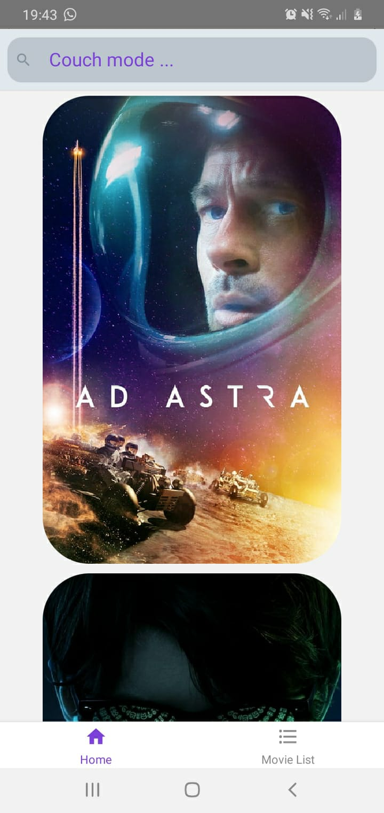
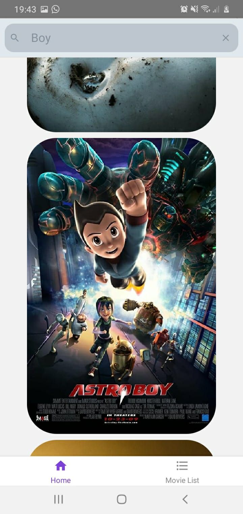
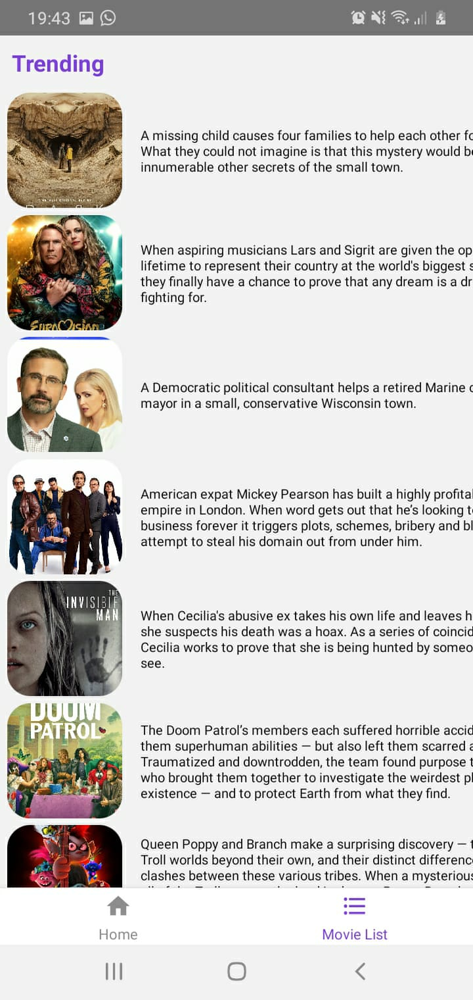

# CouchBuddies

A movie recommandation app written in React Native

<div style="max-width: 500px;margin: auto;">
    
</div>
<div style="max-width: 800px;margin: auto;">
    
        
            
<div>

## Running the app

```bash
    $ git clone https://github.com/Thagana/couchbuddies.git
```

```bash
    $ cd couchbuddies
```

```bash
    $ yarn
```

### for android

```bash
    $ react-native run-android
```

### for iOS

```bash
    $ react-native run-ios
```
